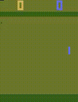
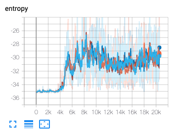
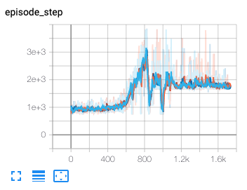
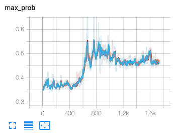
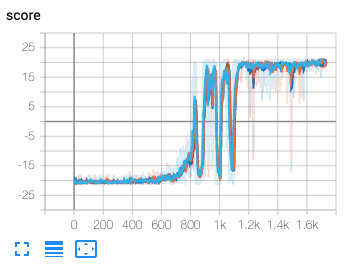
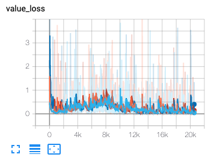

# Implementation of Scalable-Distributed-Deep-RL-with-Importance-Weighted-Actor-Learner-Architectures

* These results are from only 4 threads. So unstable to train.
* Tensorflow Implementation
* A3C type thread environment training method
* PongDeterministic-v4 environment

  

  
  
  
  
  
  

# Todo

- [x] Only CPU Training method
- [ ] Use Network protocol method
- [ ] Training on GPU, Inference on CPU

# Reference

* [IMPALA: Scalable Distributed Deep-RL with Importance Weighted Actor-Learner Architectures](https://arxiv.org/abs/1802.01561)
* [deepmind/scalable_agent](https://github.com/deepmind/scalable_agent)
* [Asynchronous_Advatnage_Actor_Critic](https://github.com/RLOpensource/Asynchronous_Advatnage_Actor_Critic)